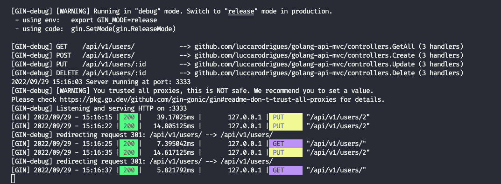
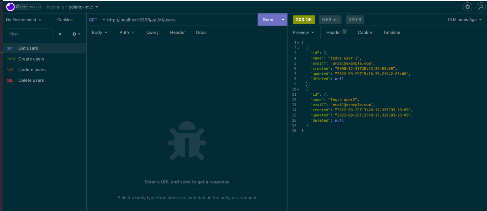

# Executar o projeto:

- Para executar projetos em Go, é necessário ter o pacote do `GO` instalado no seu ambiente.
- Seguir a documentação da instalação de acordo com o seu `SO`, package disponível em `https://go.dev/dl/`.
- Depois de instalado, rodar `go run main.go` e em seguida o projeto já devera estar rodando na porta `3333`
  

## Insomnia

- Se você possui o insomnia instalado, faça a importação da collection dentro de `doc/insomnia_collection.json`.
  
